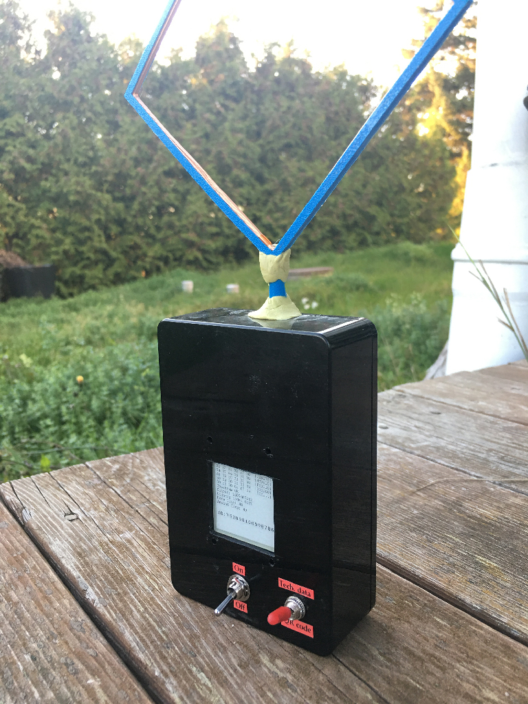

# RFID_QR
RFID scanner for Wemos D1 Mini + RFID module + E-ink screen

The basic idea is that you scan an ID chip on a cat, and it produces a QR code leading to the Swedish Sverak registry entry for the cat in question (You may want to change this). Then you can turn it off and the QR code stays on the screen, so you can scan it with your phone whenever you want. This way, the scanner doesn't need to communicate on the Internet. Unfortunately, that means you need to be able to produce a GET URL to whichever registry you want to search in. In Sweden, the Sverak cat registry seems to be the only registry that supports this.

Originally, I actually used a momentary pushbutton for power, but my current prototype has a toggle switch, since you can use a second switch to toggle between the QR code and a dump of technical data about the chip code. This is especially useful if you scan some other animal, like a dog. Just take a photo of the screen and go search manually.

There's a toggle switch on A0 (analog in), connecting the pin to either Vcc or GND. This is used to select QR Code or Technical info.

The RFID module just sends data over the serial port when it manages to scan an ID chip. Check the Doc_?.jpg pictures for all the documentation I have for this module.

The RFID module is connected on pins 12 (RX) and 16(RST), and pin 15 is allocated for the SoftwareSerial TX.

The Waveshare 1.54" E-Ink screen is connected on pins 4 (RST), 0, (DC), 2 (CS) and 5 (BUSY), plus MISO/MOSI/SCK etc. You will have to test your own screen to make sure you are using the correct library for it. I'm using EPD by Asuki Kono, and the EPD1in54.h include, but you may need to use one of the others.

